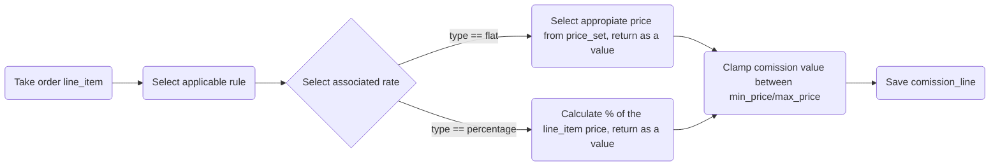
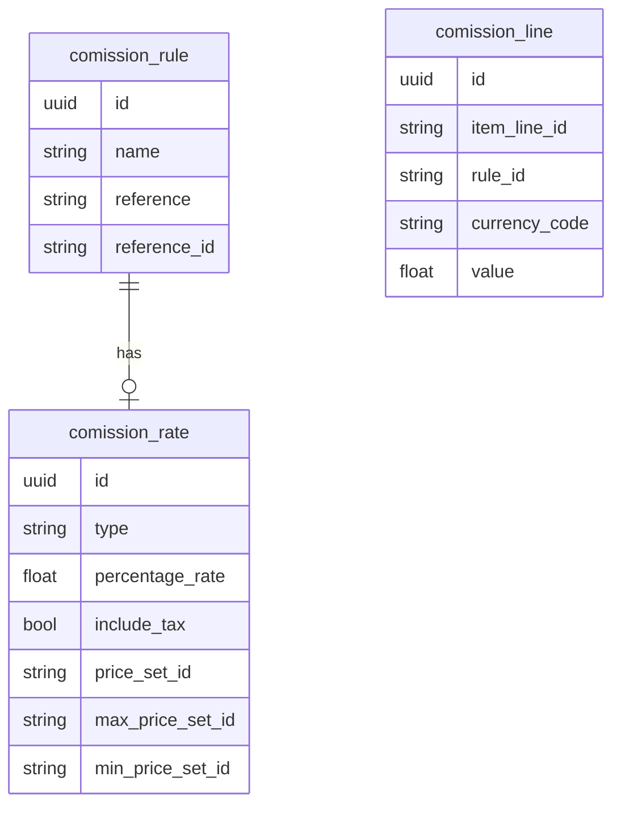

Marketplace admin can set comission rates in various combinations, which enables to charge different comission for different product types, categories, sellers etc.

# Comission rule reference types

Each comission rule has its reference. A reference entity types are listed below. There are simple (one `reference_id` at once), and combined types, that take into account more than one reference at once. Each combination (`reference` and `reference_id`) are required to be unique.

- `site` - default comission applied for all products in the marketplace, can be overriden by other rules,
- `product_type` - applied to products of specified type,
- `product_category` - applied to products from specified category,
- `seller+product_category` - applied to products from specified category, and sold by specified seller,
- `seller+product_type` - applied to products of specified type, and sold by specified seller,
- `seller` - applied to products sold by specified seller.

# Comission rules priority

Multiple different condition rates can be applied to each of the items in order. That's why some of the rules are more important that others, and during comission calculation process only one is applied. Rule reference types priority is described below.

1. `seller+product_type`
2. `seller+product_category`
3. `seller`
4. `product_type`
5. `product_category`
6. `site`

# Comission rate

Each rule should have applicable rate attached. Comission rate entity describes the details on how the comission should be calculated. Available options:

- `type` - `flat` or `percentage`
- `percentage_rate` - applicable if `type` is `percentage`
- `include_tax` - indicates if comission should be calculated including tax
- `price_set_id` - applicable if `type` is `flat`
- `max_price_set_id` - maximum comission value
- `min_price_set_id` - minimum comission value

# Comission rate types

- `flat` - share for marketplace is a fixed amount,
- `percentage` - share for marketplace is a percent of price.

# Calculation

# Database models

