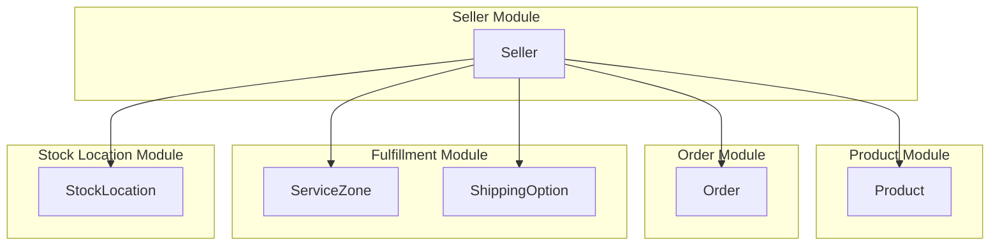
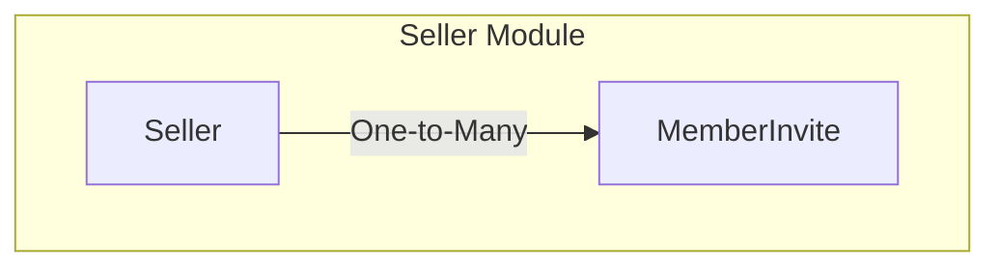

Mercur comes with a `Seller` module that allows you to manage seller products, orders, service zones and shipping options.

# Entities

- `Seller`
- `Member`
- `MemberInvite`

# Seller

In Mercur, the `Seller` is the entity that represents member group in the marketplace.
You can think of a seller as a group of members that share the same products, orders, service zones and shipping options.
By default, a seller is linked to Medusa's default entities such as:

- `Product`
- `Order`
- `Stock Locations
- `Service Zone`
- `Shipping Option`

# Member

`Member` is the entity that represents a user in the marketplace that can manage seller products, orders, service zones and shipping options.

# Member Invite

`Member Invite` is the entity that represents a pending member invitation to a seller in the marketplace.

